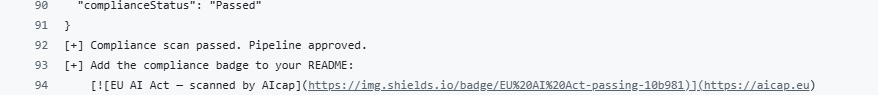
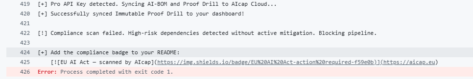
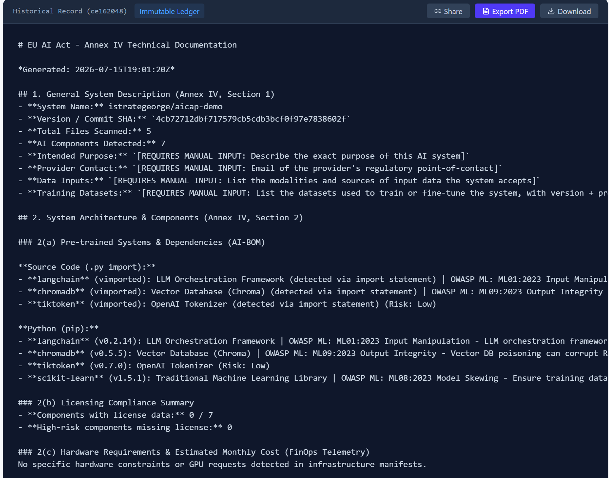
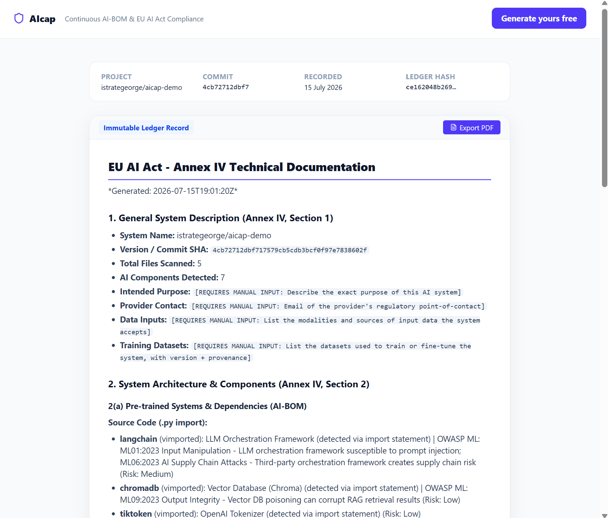
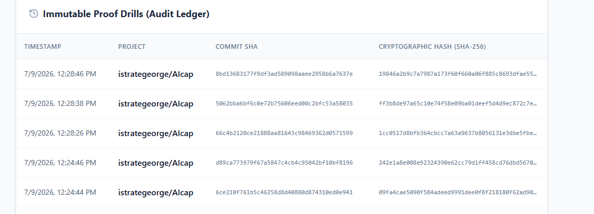

# 🛡️ AIcap: Continuous AI-BOM & Compliance Automator

[](https://github.com/marketplace/actions/continuous-ai-bom-scanner)
[](https://opensource.org/licenses/MIT)
[]()
[]()
[]()

**AIcap** is the developer-first compliance and FinOps scanner for the AI supply chain. It shifts EU AI Act compliance left into CI/CD, detects expensive GPU misconfigurations, and generates audit-ready documentation — all in a single binary.

> **Why AIcap?** Every AI system shipped to the EU market must comply with the AI Act by August 2026. AIcap automates the hardest parts: dependency tracking, model governance, license auditing, and Annex IV documentation — so your team ships faster, not slower.

---

## 📸 See it in action

**CI enforces the policy, not just reports it** — passes clean, blocks on unmitigated high-risk deps, and prints a README badge either way:

| ✅ Passing | 🚫 Blocking |
|---|---|
|  |  |

**Annex IV technical documentation, generated from the scan** — export to PDF, share a link, or download the markdown:



**Shareable, tamper-evident reports** — send a link to an auditor or customer; no login required on their end:



**Every scan is hash-chained into an immutable audit ledger:**



---

## ✨ Features

### 🔍 AI Supply Chain Scanner
| What it scans | How |
|---|---|
| **Python** (`requirements*.txt`, `pyproject.toml` incl. PEP 621, lockfiles, source imports) | Detects AI libraries + hardcoded model IDs |
| **Jupyter** (`.ipynb`) | Scans code cells for imports, model IDs, secrets, and `%pip install` magics |
| **Node.js** (`package.json`, pnpm/yarn lockfiles) | Matches against 130+ known AI/ML packages, including scoped ones (`@anthropic-ai/sdk`, Vercel AI SDK, `@langchain/*`) |
| **Go** (`go.mod`, AST analysis) | Parses module dependencies + string literals |
| **Docker** (`Dockerfile`, `Dockerfile.*`) | Detects AI base images, model weight COPY, pip installs |
| **Model weights** (`.safetensors`, `.onnx`, `.pt`, `.h5`, `.gguf`, etc.) | Flags local model files with license enrichment |
| **Secrets** (`.env`, source code) | Detects 13+ AI platform API key patterns (OpenAI, Anthropic, HF, etc.) |

### ⚖️ Compliance Automation
- **EU AI Act Annex IV** — Auto-generates technical documentation with risk register, licensing summary, and policy compliance
- **Article 50 transparency duties** — Flags the four disclosure obligations that bite on 2 Aug 2026 (tell users they're talking to an AI; mark synthetic output machine-readably; inform people subject to emotion/biometric analysis; disclose deep fakes), with evidence of any watermarking or C2PA provenance found in the dependency graph
- **Article 5 prohibited-practice indicators** — Flags components whose capabilities fall within the scope of the prohibitions already in force since 2 Feb 2025 (emotion inference, biometric identification and categorisation). Indicators with the legal question attached, never verdicts: whether a prohibition applies turns on deployment context no scanner can observe
- **OWASP ML Top 10** — Cross-references dependencies with known ML attack vectors (supply chain, prompt injection, model theft, data poisoning)
- **Policy-as-Code** — `.aicap.yml` configuration for model governance (blocked/allowed models, risk thresholds, license restrictions)
- **SPDX 2.3** — Linux Foundation / ISO 5962 SBOM output, the format named in US federal procurement guidance and many enterprise questionnaires. Vendor licence strings become `LicenseRef` entries rather than invalid expressions; advisories attach as SECURITY external references
- **CycloneDX 1.5** — Industry-standard SBOM output with Package URLs (PURLs) and a populated `vulnerabilities` array (live OSV advisories, linked to components by `bom-ref`, with upgrade targets) so Dependency-Track and friends ingest what the scan already found

### 💸 AI FinOps
- **Kubernetes** — Detects unoptimized GPU requests (missing MIG/time-slicing)
- **Terraform** — Identifies GPU instances across AWS/Azure/GCP with hourly cost data and spot pricing analysis
- **Helm** — Analyzes `values.yaml` for GPU allocation without autoscaling, detects model serving frameworks

### 🔒 Immutable Audit Ledger (Pro)
- SHA-256 hash chain over every scan (commit + BOM + documentation), so editing,
  reordering, or deleting any historical entry breaks verification at every later link
- **Ed25519 signature on every entry**, with the key held in the application
  environment and never in the database — so possession of the database is not
  the ability to rewrite history
- Shareable report links — hand an auditor a URL without giving them an account
- Cloud dashboard for historical Proof Drills with timestamp verification
- **Scan-to-scan drift** — what changed since the previous commit: new and
  removed components, version moves, compliance-posture flips, and above all
  advisories published against dependencies you have not touched. That last
  one is the case a point-in-time audit structurally cannot catch, and it is
  the evidence EU AI Act Article 72 post-market monitoring asks for

#### Verifying a shared report yourself

A shared report is only evidence if the recipient can check it without
trusting the sender. Every shared report carries an `attestation` block, and
the public key is published unauthenticated:

```bash
# The report, including its signature and the exact bytes that were signed
curl "https://<backend>/api/public/report?token=<share-token>"

# The Ed25519 public key that signed it
curl "https://<backend>/api/ledger/public-key"
```

Base64-decode `attestation.signedMessage` and `attestation.signature`, then
verify them against that public key with any Ed25519 implementation. A valid
signature proves the record was produced by AIcap and has not been altered
since — including by the party who sent you the link.

The hash chain alone could not tell you that: it proves the entries are
consistent with each other, not who wrote them. Pin the public key out of band
(a DPA annex, your own records) if you don't want to trust the endpoint serving
it.

**What the free CLI does and does not give you.** The scan, the Article 9 risk
register, the live CVE enrichment, and the Annex IV draft are all free and run
entirely in your own pipeline. What Pro adds is *provenance*. A document you
generated on the machine that holds your code can be regenerated, edited, or
back-dated by anyone with access to that machine, so it is not evidence of
anything to a third party — and a locally generated draft says exactly that in
its § 5. Anchoring it to the ledger is what makes it checkable by someone who
does not have to take your word for it.

---

## 🚀 Quick Start

### GitHub Actions (Recommended)

```yaml
name: AI Compliance Scan

on:
  push:
    branches: [ "main" ]
  pull_request:
    branches: [ "main" ]

jobs:
  aicap-scan:
    runs-on: ubuntu-latest
    steps:
      - name: Checkout Repository
        uses: actions/checkout@v4

      - name: Run AIcap Compliance Scan
        uses: aicaplabs/AIcap@v1.6.0
        with:
          api-key: ${{ secrets.AICAP_API_KEY }}
          scan-directory: '.'
```

### CLI Mode

```bash
# Standard AI-BOM output (JSON)
aicap --cli ./my-project

# CycloneDX SBOM format (for enterprise toolchains)
aicap --cli ./my-project --cyclonedx

# Annex IV technical documentation draft (free — no API key needed)
aicap --cli ./my-project --annex-iv annex-iv.md

# Auto-sync to AIcap Cloud — anchors the same document to the audit ledger
AICAP_API_KEY=aicap_pro_sk_xxx aicap --cli ./my-project
```

### Local Development

```bash
# Clone & run backend
git clone https://github.com/aicaplabs/AIcap.git
cd AIcap
go run .

# Run frontend (separate terminal)
cd frontend && npm install && npm run dev
```

---

## 📋 Policy-as-Code (`.aicap.yml`)

Create a `.aicap.yml` in your project root to enforce model governance policies:

```yaml
# Block specific models
blocked_models:
  - gpt-3.5-turbo
  - claude-2

# Or use an allowlist (anything not listed is blocked)
allowed_models:
  - gpt-4-turbo
  - claude-3-opus

# Block pipeline on any high-risk dependency
block_on_high_risk: true

# Require license information for all high-risk components
require_licenses: true

# Only permit specific license types
allowed_licenses:
  - MIT
  - Apache-2.0
  - llama3.1
```

---

## 📥 Inputs

| Input | Description | Required | Default |
|---|---|---|---|
| `api-key` | AIcap Pro API key for cloud sync | No | `""` |
| `scan-directory` | Target directory to scan | No | `.` |
| `annex-iv-path` | Where to write the Annex IV draft | No | `aicap-annex-iv.md` |

## 📤 CLI Flags

| Flag | Description |
|---|---|
| `--cli` | Run in headless CI/CD mode |
| `--cyclonedx` | Output CycloneDX 1.5 JSON instead of AIcap format |
| `--spdx` | Output SPDX 2.3 JSON instead of AIcap format |
| `--annex-iv <path>` | Write the Annex IV technical documentation draft to `<path>` |
| `--no-annex-iv` | Skip Annex IV generation (and the OSV lookups it performs) |
| `--image <ref>` | Scan a container image from a registry. Repeatable |
| `--image-tar <path>` | Scan a local `docker save` tarball. Repeatable |

## 🌍 Environment Variables

| Variable | Description |
|---|---|
| `AICAP_API_KEY` | Pro API key for cloud sync |
| `AICAP_CATALOG_URL` | Remote detection-catalog bundle (AI libraries, model literals, model families, licences). Refreshes detection without upgrading the binary; falls back to the embedded catalogs on any failure |
| `AICAP_GPU_COSTS_URL` | Remote GPU pricing catalog; falls back to the embedded one |
| `AICAP_OSV_DISABLED` | Set to `true` to skip live CVE/GHSA enrichment from OSV.dev |
| `GITHUB_REPOSITORY` | Auto-detected in GitHub Actions |
| `GITHUB_SHA` | Auto-detected commit SHA |
| `SUPABASE_DB_URL` | PostgreSQL connection for SaaS mode |
| `AICAP_LEDGER_SIGNING_KEY` | Base64 Ed25519 seed signing each ledger entry (server-side). Generate with `aicap --gen-ledger-key`. Unset means entries are written unsigned and `/api/verify-chain` reports them as such |
| `STRIPE_SECRET_KEY` | Stripe integration for Pro subscriptions |
| `STRIPE_WEBHOOK_SECRET` | Stripe webhook signature verification |

---

## 🛠️ Architecture

AIcap uses multi-layered parsing written in optimized Go:

```
┌─────────────────────────────────────────────────────┐
│                    AIcap Scanner                     │
├──────────────┬──────────────┬───────────────────────┤
│  Manifests   │  Source Code │  Infrastructure       │
│              │              │                       │
│ requirements │  Go AST      │  Kubernetes YAML      │
│ package.json │  Python      │  Terraform .tf        │
│ go.mod       │  imports     │  Helm values.yaml     │
│ pyproject    │  .env files  │  Dockerfile           │
│ Dockerfile   │  secrets     │  Model weight files   │
├──────────────┴──────────────┴───────────────────────┤
│              AI-BOM + FinOps Findings                │
├─────────────────────────────────────────────────────┤
│  OWASP ML Top 10 Enrichment                         │
├─────────────────────────────────────────────────────┤
│  Policy-as-Code Evaluation (.aicap.yml)             │
├─────────────────────────────────────────────────────┤
│  Output: JSON │ CycloneDX 1.5 │ Annex IV Markdown   │
└─────────────────────────────────────────────────────┘
```

### Scanned File Types

| File | Parser | Detection |
|---|---|---|
| `requirements*.txt` | Regex | AI libraries by name (incl. `requirements-dev.txt`, `requirements/base.txt`) |
| `package.json` | JSON | Dependencies + devDependencies |
| `go.mod` | Line parser | AI Go modules in require blocks |
| `pyproject.toml` | Section + array parser | Poetry tables and PEP 621 `dependencies` / optional extras |
| `Dockerfile` | Line parser | Base images, COPY weights, pip install |
| `*.py` | Regex + import | `import torch`, hardcoded model strings, secrets |
| `*.ipynb` | JSON + cell scan | Notebook code cells: imports, model strings, secrets, `!pip install` |
| `*.go` | Go AST | String literal analysis for models & secrets |
| `.env` | Key-value parser | 13+ AI platform API key patterns |
| `*.yaml` / `*.yml` | Line parser | Kubernetes GPU requests, MIG detection |
| `values.yaml` | Helm parser | GPU resources, autoscaling, model serving |
| `*.tf` | Terraform parser | AWS/Azure/GCP GPU instances, spot pricing |
| `*.safetensors`, `.onnx`, `.pt`, etc. | File detection | Local model weight flagging |

---

## ☁️ AIcap Pro (Cloud Dashboard)

The CLI scanner is **free forever**. AIcap Pro adds:

- 📊 **Historical Proof Drills** — Timestamped, cryptographically hashed compliance records
- 🔑 **Secure API Keys** — Server-side generated with `crypto/rand`
- 📜 **Annex IV Reports** — Auto-generated EU AI Act documentation with audit trail
- 💳 **Stripe Integration** — Full subscription lifecycle (auto-provisioning, cancellation, payment failure handling)

### Setup
1. Sign up at the AIcap Dashboard
2. Generate your API key (Settings → API Keys)
3. Add `AICAP_API_KEY` to your repo's GitHub Secrets
4. Auditors can retrieve timestamped Markdown reports for any historical release

---

## 🧪 Testing

```bash
# Run all 47 tests
go test -v ./...

# Run specific test category
go test -v -run "TestParseTerraform" ./...
go test -v -run "TestEnrichWithOWASP" ./...
go test -v -run "TestParseEnvFile" ./...
```

**Test Coverage:**
| Category | Tests |
|---|---|
| Python parsers (requirements, imports, source) | 6 |
| Package.json parser | 2 |
| Go AST parser | 3 |
| Go module parser | 3 |
| PyProject.toml parser | 3 |
| Dockerfile parser | 4 |
| Terraform FinOps parser | 4 |
| Helm values parser | 3 |
| .env secret scanner | 4 |
| Policy engine | 5 |
| CycloneDX SBOM | 3 |
| OWASP ML enrichment | 2 |
| Annex IV generation | 1 |
| Integration tests | 2 |
| Serialization | 1 |
| **Total** | **47** |

---

## 📄 License

MIT License — see [LICENSE](LICENSE) for details.

---

*Built with ❤️ for DevOps and Security Engineers who ship AI responsibly.*